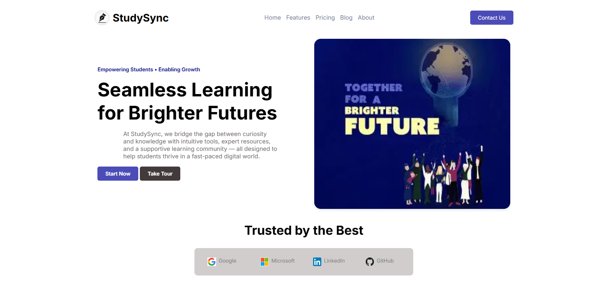

# 🎓 StudySync – Educational Landing Page

Welcome to **StudySync** — a clean, responsive, and professional educational landing page built entirely with **HTML + CSS**.

No frameworks. No JavaScript. Just pure frontend craft, CSS-only modal popups, smooth animations, and an elegant dark mode toggle. 🌗✨

> 💡 “Just a simple page,” they said…  
> 🚀 “Now it’s a fully interactive, responsive, modal-powered learning hub!”

---

## ✨ Features

- 📱 **Fully Responsive Layout** — adapts seamlessly across mobile, tablet, and desktop
- 🌙 **Dark/Light Mode Toggle** — pure CSS switch with smooth transitions
- 💬 **Testimonial Modals** — card click opens fullscreen popup with image, quote & close button
- 🔁 **Infinite Scrolling Testimonials** — horizontal auto-scroll like a carousel, with no JS
- 🧩 **6 Feature Cards** — icons, hover animations, soft backgrounds
- 📨 **Animated Newsletter Signup** — engaging call-to-action with scroll effects
- 🎯 **Pure HTML & CSS** — semantic layout, Flexbox, Grid, keyframe animations

---

## 📸 Preview

---

## 📁 Project Structure

StudySync-landing-page/
├── index.html ← Full webpage structure
├── styles.css ← CSS for layout, themes, modals, and responsiveness
├── preview.png ← Screenshot preview (add manually)
└── README.md ← You're reading it!

---

## 🛠️ How to Use

1. **Clone or Download** this repository  
2. Open `index.html` in your browser  
3. Customize colors, text, or structure as needed  
4. Reuse this layout in your portfolio or landing pages

---

## 💡 Project Motivation

This landing page was created to:

- Build a portfolio-ready educational template without JavaScript
- Practice responsive layout techniques using only HTML & CSS
- Explore CSS-only modal interactions and toggle-based themes
- Demonstrate a clean, animated, and user-friendly learning UI

---

## 🙌 Like This Project?

If you found this useful or inspiring:

- ⭐ Star this repo  
- 🔁 Fork it and build your own version  
- 🧠 Study the layout for your next web project  
- 🤝 Connect with me below!

---

## 📬 Connect with Me

- 🔗 [LinkedIn – Naitik Gupta](https://www.linkedin.com/in/naitik-gupta-81700233a)  
- 💻 [GitHub – naitik2043](https://github.com/naitik2043)

---

## 📄 License

This project is licensed under the [MIT License](LICENSE).

---

## 🏷️ Attribution

Created by **Naitik Gupta**.

If you use or modify this code in any public project or repository, kindly give proper credit and link back to the original repository:

🔗 [Original GitHub Repo](https://github.com/naitik2043/StudySync-landing-page)

